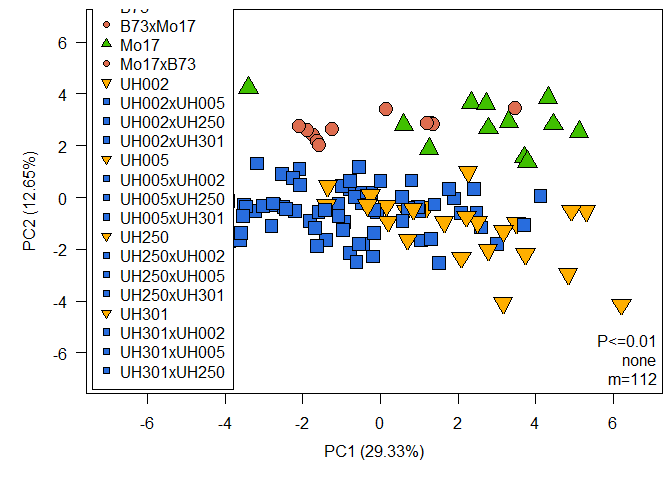

<!-- README.md is generated from README.Rmd. Please edit that file -->

# MetabolomicsBasics

<!-- badges: start -->
[](https://github.com/janlisec/MetabolomicsBasics/actions/workflows/R-CMD-check.yaml)
[](https://CRAN.R-project.org/package=MetabolomicsBasics)
<!-- badges: end -->

The goal of MetabolomicsBasics is to provide a set of functions to
investigate raw data (a matrix of intensity values) from (metabol)omics
experiments, i.e.  following peak picking and signal deconvolution.
Functions can be used to normalize data, detect biomarkers and perform
sample classification. A detailed description of best practice usage may
be found in the publication
<https://link.springer.com/protocol/10.1007/978-1-4939-7819-9_20>.

## Installation

You can install the development version of MetabolomicsBasics from
[GitHub](https://github.com/) with:

``` r
# install.packages("devtools")
devtools::install_github("janlisec/MetabolomicsBasics")
```

## Example

A typical use case would be to compute a Principal Component Analysis:

``` r
raw <- MetabolomicsBasics::raw
sam <- MetabolomicsBasics::sam
MetabolomicsBasics::RestrictedPCA(dat = raw, sam = sam, group.col = "GT")
```


